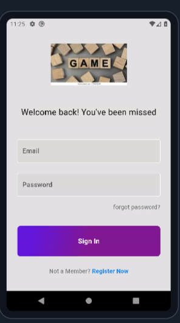
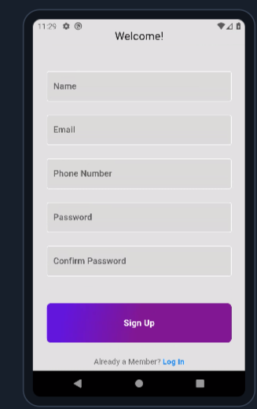
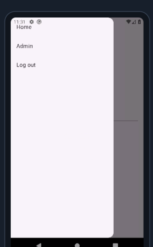
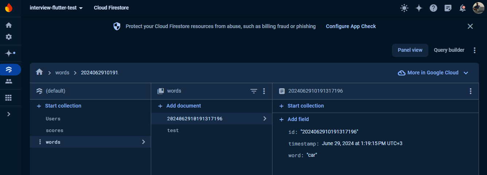
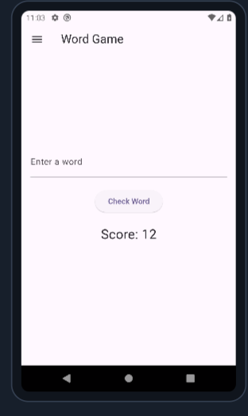

# Flutter Word Game

Welcome to the Flutter Word Game project! This is a simple word game where users can input a word, check its validity, and receive feedback. The app also integrates with Firebase to manage word lists and display scores.

## Table of Contents
- [Features](#features)
- [Installation](#installation)
- [Usage](#usage)
- [Screenshots](#screenshots)
- [Contributing](#contributing)
- [License](#license)

## Features
- Input a word and check its validity against a predefined list stored in Firebase.
- Display a score based on the number of valid words.
- Provide feedback for correct and incorrect words.
- Use StreamBuilder to display a list of items from Firebase with titles.

## Installation

### Prerequisites
- Flutter SDK: [Install Flutter](https://flutter.dev/docs/get-started/install)
- Dart SDK: Dart is included with Flutter
- Firebase account: [Create a Firebase project](https://console.firebase.google.com/)

### Setup
1. **Clone the repository:**
    ```bash
    git clone https://github.com/mugumbyabenon/fluttertest.git
    ```

2. **Navigate to the project directory:**
    ```bash
    cd your-repo-name
    ```

3. **Install dependencies:**
    ```bash
    flutter pub get
    ```


4. **Run the app:**
    ```bash
    flutter run
    ```

## Usage

- Launch the app on your device/emulator.
- The app starts with a login page incase its your first install or your are logged out 


*Login Screen*
- The app has a  signup page incase its your first install so that you can sign up


*SignUp Screen*
-The app has the game screen below as the landing page and the app bar for app navigation is as below


*sidebar Screen*
- Enter a word in the input field and press the submit button to check its validity.
- The app will display whether the word is valid or not and update the score accordingly.
- The app reads the words stored on firebase collection called words and score you for each correct word .
Each user can select a word only once to get points.


*Words Collection Screen*
- The app reads the scores stored on firebase collection called scores so that a user doesnot loose their score.


*Score collection Screen*
## Screenshots

Here are some screenshots of the UI design:


*Home Screen*


*Game Screen*

To include images in your repository:
1. Create an `images` directory in the root of your repository.
2. Add your screenshots to this directory.
3. Reference these images in your README file using markdown syntax as shown above.

## Contributing

Feel free to fork the repository, create a branch, and submit a pull request. For major changes, please open an issue first to discuss what you would like to change.

## License

This project is licensed under the MIT License - see the [LICENSE](LICENSE) file for details.
