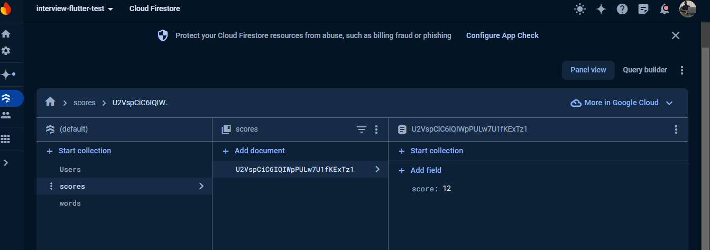

# Flutter Word Game

Welcome to the Flutter Word Game project! This is a simple word game where users can input a word, check its validity, and receive feedback. The app also integrates with Firebase to manage word lists and display scores.

## Table of Contents
- [Features](#features)
- [Installation](#installation)
- [Usage](#usage)
- [Screenshots](#screenshots)
- [Contributing](#contributing)
- [License](#license)
- - [Resilience and Innovation Test](#ResilienceandInnovationTest)
Resilience and Innovation Test:
## Features
- Input a word and check its validity against a predefined list stored in Firebase.
- Display a score based on the number of valid words.
- Provide feedback for correct and incorrect words.
- Use StreamBuilder to display a list of items from Firebase with titles.

## Installation

### Prerequisites
- Flutter SDK: [Install Flutter](https://flutter.dev/docs/get-started/install)
- Dart SDK: Dart is included with Flutter
- Firebase account: [Create a Firebase project](https://console.firebase.google.com/)

### Setup
1. **Clone the repository:**
    ```bash
    git clone https://github.com/mugumbyabenon/fluttertest.git
    ```

2. **Navigate to the project directory:**
    ```bash
    cd your-repo-name
    ```

3. **Install dependencies:**
    ```bash
    flutter pub get
    ```


4. **Run the app:**
    ```bash
    flutter run
    ```

## Usage

- Launch the app on your device/emulator.
- The app starts with a login page incase its your first install or your are logged out 


*Login Screen*


- The app has a  signup page incase its your first install so that you can sign up


*SignUp Screen*
-The app has the game screen below as the landing page and the app bar for app navigation is as below


*sidebar Screen*


- Enter a word in the input field and press the submit button to check its validity.


- The app will display whether the word is valid or not and update the score accordingly.

- The app reads the words stored on firebase collection called words and score you for each correct word .
Each user can select a word only once to get points.


*Words Collection Screen*

- The app reads the scores stored on firebase collection called scores so that a user doesnot loose their score.



*Score collection Screen*

- The app has an Admin section where admins can perform CRUD(Create,Read,Update,Delete) functions.


*adminpage Screen*

- In the page above, we have a users list that is a stream of all the users registered on my app from the user collection. The admin user can make other users admin so that they can have admin rights to add new words to the game as shown


*makeadmin Screen*
- The user collection is as below


*user Screen*


- The admin page also contains Words List section where we can view the words existing in the game with a delete button so as to delete the words. The delete button deletes words from the words firestore collection


*wordlist Screen*

- The word collection is as below


*wordscolle Screen*

- The admin can also add new words to the words collection as seen below


*addword*
## ResilienceandInnovationTest:

Within the code, we employed try and catch blocks for all functions that are performing and  processing.We then created a logErrorToFirestore function located in the components folder. For every error we created a firestore collection to log the error name, time and user on which it happened. With this setup we can ensure that we log all crush errors or any other errors in order to get realtime updates from user usage

## Contributing

Feel free to fork the repository, create a branch, and submit a pull request. For major changes, please open an issue first to discuss what you would like to change.

## License

This project is licensed under the MIT License - see the [LICENSE](LICENSE) file for details.
